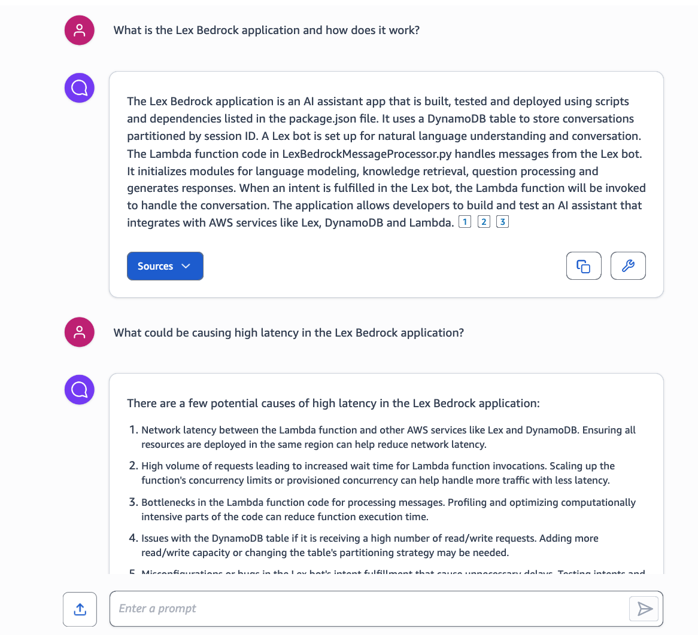

# Code Analyis through Pre-Processing with Amazon Q for Business

## Introduction
This project demonstrates how to use Amazon Q for Business to analyze code. We will use the Amazon Q for Business application to pre-process a code base by first generating documentation about the code. We will then ingest the documentation into the Amazon Q application's index. This will allow us to pull more relevant information from the index when we ask questions about the code.

This can help Q pull the relevant information from the index when we ask questions about the code. This can then help us to ask Q to generate detailed next steps to improve the codebase. This integrates nicely with Plugins for Amazon Q like JIRA, allowing us to rapidly find opportunities for improvement and immediately create tickets for them.

## Pre-requisites
[Configure your AWS Credentials](https://boto3.amazonaws.com/v1/documentation/api/latest/guide/credentials.html)

[CDK bootstrap](https://docs.aws.amazon.com/cdk/latest/guide/bootstrapping.html) `npm i cdk && npx cdk bootstrap`

## Deploy the solution using Cloudformation

### 1. Deploy the stack

We've made this easy by providing pre-built AWS CloudFormation templates that deploy everything you need in your AWS account.

1. Log into the [AWS console](https://console.aws.amazon.com/) if you are not already.
2. Choose one of the **Launch Stack** buttons below for your desired AWS region to open the AWS CloudFormation console and create a new stack.
3. Enter the following parameters:
    1. `Stack Name`: Name your App, e.g. LANGCHAIN-AGENTS-ANALYSIS.
    2. `ProjectName`: The project name you want to use, i.e. Langchain-Agents.
    3. `QAppUserId`: Choose the user you want to use for the Amazon Q for Business application.
    4. `RepositoryUrl`: The URL of the repository you want to analyze, i.e. https://github.com/aws-samples/langchain-agents.git.

Region | Easy Deploy Button | Template URL - use to upgrade existing stack to a new release
--- | --- | ---
N. Virginia (us-east-1) | [](https://us-east-1.console.aws.amazon.com/cloudformation/home?region=us-east-1#/stacks/create/review?templateURL=https://us-east-1-amazon-q-business-code-analysis.s3.amazonaws.com/cloudformation.yml) | https://us-east-1-amazon-q-business-code-analysis.s3.amazonaws.com/cloudformation.yml

### 2. Access the Amazon Q for Business application
1. Navigate to the [Amazon Q for Business application](https://us-east-1.console.aws.amazon.com/amazonq/home?region=us-east-1#applications).
2. Click on the application you just created.
3. Click on the live web experience and start using the chat interface.

## Use the Jupyter Notebook

Open the notebook, Generate Documentation, and run the cells in order to generate the documentation for the sample repository and store them in the index.
If you want to change the repository, you can change the `repo_url` and `ssh_url` to specify the repository you want to analyze.
Then navigate to the Amazon Q for Business application and ask questions about the repository.

## Deploy the solution using CDK
The CDK code in the `cdk` directory deploys the resources needed to set up the Q Business Code Analysis sample. Just input the repo you want to analyze in the parameters and deploy the stack. For more details, see the [README](./cdk/README.md).

## Introduction
Amazon Q for Business is good at using connectors to index data and then allowing you to chat with that data using a managed RAG system. However, as anyone familiar with RAG will know, pulling the most semantically similar data is not always the best way to get the most relevant data. Particularly when dealing with chunks of code. This is where Amazon Q for Business without data pre-processing falls short.

To solve this problem, we take advantage of Amazon Q for Business's ability to return a response from an attached file with a question.

```python
def ask_question_with_attachment(prompt, filename):
    data=open(filename, 'rb')
    answer = amazon_q.chat_sync(
        applicationId=amazon_q_app_id,
        userId=amazon_q_user_id,
        userMessage=prompt,
        attachments=[
            {
                'data': data.read(),
                'name': filename
            },
        ],
    )
    return answer['systemMessage']
```

This is useful for code analysis as we can send a file to Amazon Q for Business and ask a question about it. This allows us to transform files into high-density data points using natural langauge.

## Code Analysis
To demonstrate the power of this function, we will use it to analyze a code file. We will use the following code file as an example:

```python
file_path = "./assets/sample.py"
prompt = "Come up with a list of questions and answers about the attached file. Keep answers dense with information. A good question for a database related file would be 'What is the data flow?' or for a file that executes devops commands 'How is the code being deployed?' or for a file that contains a list of API endpoints 'What are the API endpoints and what do they do?'"
answer = ask_question_with_attachment(prompt, file_path)
```

We will then take the response from Amazon Q for Business and ingest it into the Amazon Q application's index along with the filename and prompt. This will allow us to pull more relevant information from the index when we ask questions about the code.
```python
def upload_prompt_answer_and_file_name(filename, prompt, answer, repo_url):
    amazon_q.batch_put_document(
        applicationId=amazon_q_app_id,
        indexId=index_id,
        roleArn=role_arn,
        documents=[
            {
                'id': str(uuid.uuid4()),
                'contentType': 'PLAIN_TEXT',
                'title': filename,
                'content':{
                    'blob': f"{filename} | {prompt} | {answer}".encode('utf-8')
                },
                'attributes': [
                    {
                        'name': 'url',
                        'value': {
                            'stringValue': f"{repo_url}{filename}"
                        }
                    }
                ]
            },
        ]
    )
prompt = "Generate comprehensive documentation about the attached file. Make sure you include what dependencies and other files are being referenced as well as function names, class names, and what they do. Keep the answers dense with information."
answer = ask_question_with_attachment(prompt, file_path)
upload_prompt_answer_and_file_name(file_path, prompt, answer, repo_url)
```

## Analyze Entire Repository
To analyze an entire repository, we will use the following function to loop through all the files in the repository and upload the documentation to the Amazon Q application's index.
```python
def generate_documentation_for_repo(repo_url, repo_type, repo_name):
    repo = git.Repo.clone_from(repo_url, f"./{repo_name}")
    for root, dirs, files in os.walk(f"./{repo_name}"):
        for file in files:
            file_path = os.path.join(root, file)
            prompt = "Generate comprehensive documentation about the attached file. Make sure you include what dependencies and other files are being referenced as well as function names, class names, and what they do."
            answer = ask_question_with_attachment(prompt, file_path)
            upload_prompt_answer_and_file_name(file_path, prompt, answer, repo_url)
    shutil.rmtree(f"./{repo_name}")
```

We can then ask questions about the repository and get detailed answers:

```python
def ask_question_about_repo(prompt, repo_url):
    answer = amazon_q.chat_sync(
        applicationId=amazon_q_app_id,
        userId=amazon_q_user_id,
        userMessage=prompt
    )
    return answer['systemMessage']
```

You can also navigate directly to your Amazon Q for Business application, click on the live web experience, and start using that chat interface instead.

## Conclusion
Whereas Amazon Q for Business alone will not be able to answer complex questions like, 'What is causing high-latency in my application?' After we process all the files we are able to ask these questions. This in turn allows us to ask Q to generate detailed next steps to improve the codebase. This integrates nicely with Plugins for Amazon Q like JIRA, allowing us to rapidly find opportunities for improvement and immediately create tickets for them.

## Demo 
<!-- Image url -->
